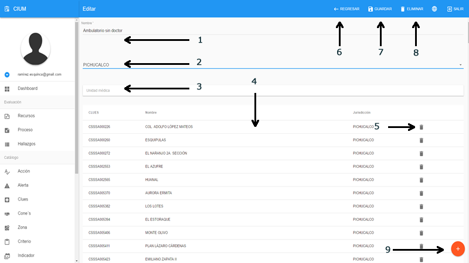
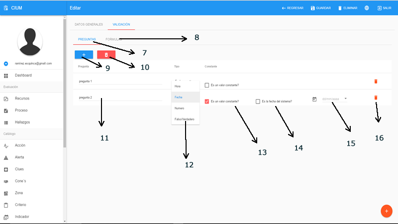
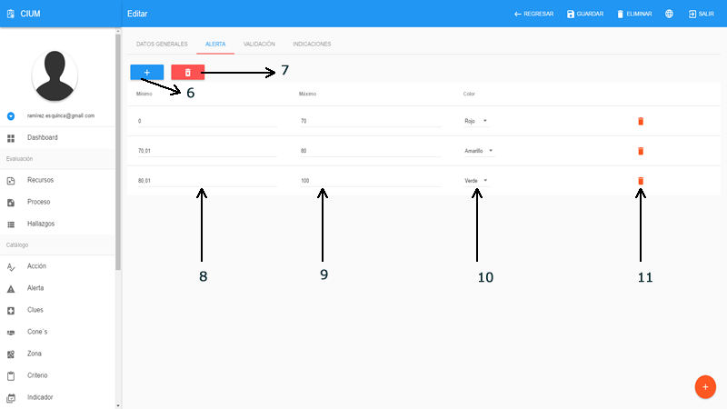

# Catálogos

En términos generales, un catálogo es la lista ordenada o clasificada que se hará sobre los datos que necesita el sistema para operar. Normalmente estos catálogos no cambian su contenido. Se crean una sola vez y después se utilizan muchas veces en operaciones y reportes.
 
Todos los catalogos tiene un listado con las opciones como se describen. 
 

>**Listado**

> - 1.- Datos
> - 2.- Paginación y limites por página
> - 3.- Opciones por registro de izquierda a derecha: ver, modificar y eliminar
> - 4.- Despegar el campo de busqueda
> - 5.- Agregar un registro nuevo

>**Listado buscar**

> - 6.- Regresar y restablecer las opciones
> - 7.- Campo de busqueda: escribir y dar enter para iniciar la busqueda

Algunos encabeceados tiene la función de ordenar por el nombre de esa columna

## Acciones

Acciones contiene todos los datos a seleccionar cuando en una evaluación se encuentra un hallazgo. 

>**Crear / Editar**

> - 1.- Nombre de la accion
> - 2.- Tipo de evaluacion en la que estara disponible
> - 3.- Regresar al listado
> - 4.- Guardar 
> - 5.- Eliminar
> - 6.- Ir a crear un registro nuevo

## Alertas

Alerta contiene todos los datos a seleccionar para identifcar las alertas por el valor que tome los indicadores en las evaluaciones. 

>**Crear / Editar**

> - 1.- Nombre de la alerta
> - 2.- Color 
> - 3.- Regresar al listado
> - 4.- Guardar 
> - 5.- Eliminar
> - 6.- Ir a crear un registro nuevo

## Clues

Clues contiene un listado de todas las unidades medicas con su informacion de la ficha tecnica. clues solo cuenta con 2 secciones listado y ficha tecnica para 
crear o modificar solicitarlo al administrador de los catalosgos de la seceretaia de salud

>**Ficha**

> - 1.- Regresar al listado
> - 2.- Imprimir (Exportar pdf) 

## Cone

Cone (Cuidado obstétrico y neonatal esencial) este catálogo agrupa las unidades medicas, es de suma importancia ya que todo los criterios dependen del nivel de cone de cada unidad médica. 

>**Crear / Editar**

> - 1.- Nombre del cone
> - 2.- Jurisdicción 
> - 3.- Buscar clues que pertenecerá al nivel de cone a crear
> - 4.- Unidades médicas agregadas 
> - 5.- Eliminar la unidad de la lista 
> - 6.- Regresar al listado
> - 7.- Guardar 
> - 8.- Eliminar
> - 9.- Ir a crear un registro nuevo

## Criterio

Criterio este catálogo contiene todos los puntos a evaluar se relaciona con indicador, cone y lugar de verificación para obtener el listado correspondiente a cada de las unidades médicas, el lugar de verificación sirve para agrupar los criterios. 

>**Lista**

> - 1.- Numero del indicador al que pertenece el criterio
> - 2.- Nombre del criterio, este campo es editable, por lo tanto, se puede cambiar el nombre desde aca, para guardar solo pulse tab o cambie de campo 
> - 3.- Este campo es para determinar el orden en el que aprecera el criterio en la lista de evaluaciones

>**Crear / Editar**

> - 1.- Pestaña general, contiene informacion general del criterio
> - 2.- Pestaña de validaciones, configurar las validaciones del criterio 
> - 3.- Nombre del criterio
> - 4.- Orden en el que aprecera en las evaluaciones
> - 5.- Seleccionar el indicador, nivel o niveles de cone y el lugar de verificación. Si el color del criterio es azul el dato es correcto, si es naranja le hace falta lugar de verificación si es rojo le hace falta selecionar un nivel de cone
> - 6.- Ir a crear un registro nuevo

>**Validacion preguntas**

> - 7.- Pestaña de preguntas
> - 8.- Pestaña de formulas
> - 9.- Agregar otra pregunta
> - 10.- Limpiar todas las preguntas
> - 11.- Preguntas creadas
> - 12.- Tipo de pregunta
> - 13.- Dar un valor constante a una pregunta
> - 14.- Dependiendo del tipo de pregunta, se asigna el valor contante en este caso fecha
> - 15.- Campo para el valor contante
> - 16.- Eliminar la pregunta

>**Validacion formula**

> - 17.- Pestaña de formula
> - 18.- Validar la configuracion de la formula mustra una ventana para probar si se logra obtener el valor deseado
> - 19.- Seleccionar la prengunta 1, de la lsita de preguntas anteriormente registradas, las preguntas son unicas por criterio por lo que se crean al instante
> - 20.- Seleccionar el operador aritmetico para obtener un resultado entre las 2 preguntas
> - 21.- Seleccionar pregunta 2
> - 22.- Seleccionar la unidad de medida del resultado
> - 23.- Operador logico comparativo
> - 24.- Valor constante a comparar con el resultado para determinar si cumple o no
> - 25.- Eliminar la formula

## Indicador

Indicador este catálogo contiene todos los indicadores para generar las evaluaciones. Se relaciona con alertaIndicador para generar los colores segun el porcentaje obtenido.

>**Pestaña general**

> - 1.- Codigo del indicador
> - 2.- Nombre del indicador 
> - 3.- Categoria para la evaluación que estará disponible
> - 4.- color para identificar el indicador
> - 5.- Ir agregar un nuevo indicador

>**Pestaña alertas**

> - 6.- Agregar una alerta
> - 7.- Limpiar todas las alertas
> - 8.- Rango minimo
> - 9.- Rango maximo
> - 10.- Color
> - 11.- Quitar alerta

>**Pestaña validacion**

La validacion de indicadores funciona de la misma forma que la de criterios

>**Pestaña validacion**

Aca se escribe una indicación para el evaluador en caso del que el indicador tenga complejidad y se necesite aclarar la fuente de datos

## Lugar de Verificación

LugarVerificacion este catálogo contiene los lugares de verificacion para agrupar los criterios de cada indicador para las unidades médicas.

>**Crear / Editar**

> - 1.- Nombre del lugar de verificación
> - 2.- Regresar al listado
> - 3.- Guardar 
> - 4.- Eliminar
> - 5.- Ir a crear un registro nuevo

## Plazo acción

PlazoAccion este catálogo contiene los lugares de verificacion para agrupar los criterios de cada indicador para las unidades médicas.

>**Crear / Editar**

> - 1.- Nombre del plazo de la acción
> - 2.- Tipo (tiempo)
> - 3.- Valor con respecto al tipo
> - 4.- Regresar al listado
> - 5.- Guardar 
> - 6.- Eliminar
> - 7.- Ir a crear un registro nuevo

## Zona

Zona este catálogo contiene las zonas y las unidades médicas que la conforman, Debido a que cada zona puede tener muchas unidades médiacas y para no hacer tardio la carga del listado se recomienda descargar el listado y depues hacer un recorrido de cada uno de los resultados para extraer los datos del metodo show.

>**Crear / Editar**

> - 1.- Nombre de la zona o equipo
> - 2.- Jurisdicción 
> - 3.- Buscar clues que pertenecerá al nivel de cone a crear
> - 4.- Unidades médicas agregadas 
> - 5.- Eliminar la unidad de la lista 
> - 6.- Regresar al listado
> - 7.- Guardar 
> - 8.- Eliminar
> - 9.- Ir a crear un registro nuevo