# Evaluaciones

En este apartado se encuentra las parte transaccional de la aplicación es decir la parte donde se generan y procesan los datos recabados de las evaluaciónes.
 
 
Las evaluaciónes de recursos y procesos tiene un listado con el formato y las opciones siguientes:

>**Listado**

> - 1.- Despegar el campo de busqueda
> - 2.- Agregar una evaluación nueva
> - 3.- Generar una evaluación impresa para llevar a las unidades médicas que no tengan internet 
> - 4.- Estado de la evaluación verde terminado, amarillo en edición. Al hacer click en la linea se abre la evaluación
> - 5.- Eliminar la evaluación solo disponible para las que no se han cerrado
> - 6.- Datos
> - 7.- Enviar la evaluacion por correo, diponble solo para las que estan cerradas

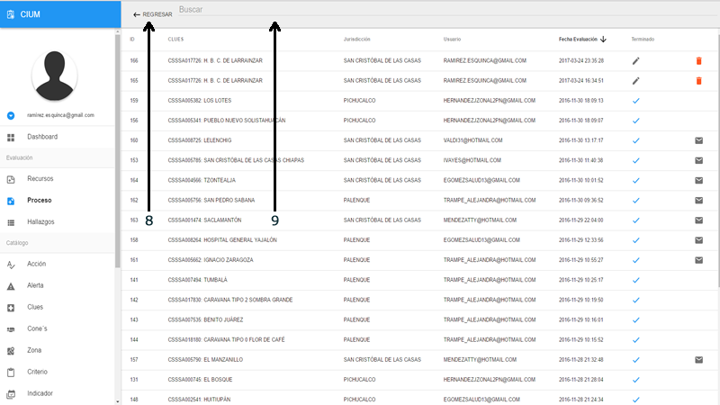

>**Listado buscar**

> - 8.- Regresar y restablecer las opciones
> - 9.- Campo de busqueda: escribir y dar enter para iniciar la busqueda

## Recursos

Recursos es la evaluación que en las unidades médicas se encarga de monitoriar los indicadores de medición del tipo abasto y equipos, asi como los recursos humanos.

### Crear una nueva evaluación

Para crear una evaluación de recursos podemos acceder al formulario desde la pantalla inicial y hacer click en el menu de "Crear recurso"

#### En el listado de recursos

>**Nuevo**

> - 1.- Click en el menu lateral izquierdo RECURSO
> - 2.- Click en nuevo

#### Abre un pantalla para crear la ficha técnica

>**Ficha**

> - 1.- Buscar la unidad medica, puede buscar por jurisdicción, municipio, equipo zonal, nivel de cone, nombre clues o clave clues
> - 2.- Regresar al listado
> - 3.- Botón para crear la ficha este se habilita al seleccionar una unidad médica

>**Seleccionar Unidad**

> - 1.- Al escribir se crea una lista con los resultado
> - 2.- Si los resultados son muchos se crea un scroll a lado de la lista para navegar entre los resultados
> - 3.- Al seleccionar una unidad se llena la ficha técnica
> - 4.- Se habilita el botón crear
> - 5.- Cambiar de unidad médica

Para crear la evaluación hacer click en el botón que se habilito (CREAR). Se muestra un mensaje y cambia de pantalla para seleccionar los indicadores a evaluar.

### Agregar indicadores

#### Pantalla de evaluación

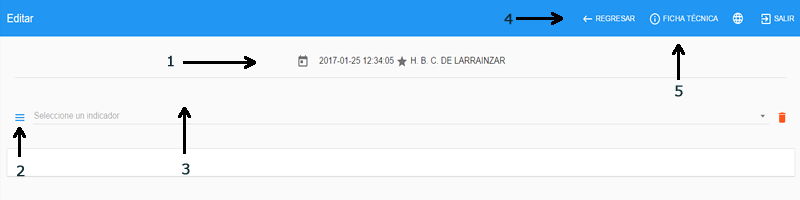

>**Pantalla inicial**

> - 1.- Fecha y nombre de la clues
> - 2.- Menú de indicadores
> - 3.- Indicadores agregados a la evaluación, si no se ha agregado ninguno muestra el mensaje "No se ha agregado ningun indicador" si ya hay por lo menos un indicador muestra "Seleccione un indicador"
> - 4.- Regresar al listado
> - 5.- Ver/Editar ficha técnica

Si nos equivocamos al seleccionar la unidad podemos cambiarla en la opcion ficha técnica

>**Fichar Ver/Editar**

> - 1.- Si se quiere cambiar la unidad médica click en editar

>**Ficha Editar**

> - 2.- El botón cambia a guardar para cambiar la unidad médica, al hacer click cierra la ventana
> - 3.- Buscar la unidad médica. Misma mecanica que al crear
> - 4.- Cerrar la ventana

#### Agregar un indicador

>**Menú indicador**

> - 1.- Click en el botón menu indicador
> - 2.- Seleccionar un indicador, al selecionar uno se quita del menu y se agrega a la lista desplegable, y se cargan los criterios
> - 3.- Scroll para cargar los demas indicadores

> - 4.- Si esta evaluando un indicador y le da seleccionar otro el sistema pide confirmación por que se borrara los datos del indicador que no ha guardado
> - 5.- Cancelar el cambio 
> - 6.- Aceptar el cambio y cargar otros datos

> - 6.- Puede cambiar entre indicadores evaluados recientemente en la lista a lado del menu, aca se muestra el codigo y nombre del indicador

Si el indicador seleccionado tiene validacion, aparecerá un cuadro con úna lista de preguntas para determinar si se evalua o no la Unidad Médica

#### Criterios

>**Menú indicador**

> - 1.- Muestra la cantidad de criterios y el total evaluados
> - 2.- Lugar donde se tienen que verificar los criterios
> - 3.- Criterios a evaluar
> - 4.- Opciones de respuesta Si/No
> - 5.- Hallazgo se habilita cuando en el indicador marcamos un no en un criterio
> - 6.- Acciones para resolver el hallazgo
> - 7.- Boton guardar se habilita una vez completado los criterios y el hallazgo si existe

> - 8.- Cuando todos los indicadores estan completa su evaluación el botón cerra aparece
> - 9.- Si hacemos click en el botn cerrar el sistema pide confirmación y aparecer un mensaje

#### Resultado de la evaluación

> - 1.- Regresar al listado
> - 2.- Fecha de creación de la evaluación
> - 3.- Ficha técnica de la unidad médica evaluada
> - 4.- Resultado de los indicadores evaluados
> - 5.- Detalle de los indicadores desglose de criterios y su valor de la evaluación
> - 6.- Ocultar/Mostrar el detalle de criterios para incluir en la impresión o no
> - 7.- Generar/Imprimir evaluación

> - 8.- Por ultimo la firma del responsable de la unidad. Si la evaluación fue realizada con la APP MOVIL aparacera la firma digital

## Procesos

Procesos es la evaluación que en las unidades médicas se encarga de monitoriar los indicadores de medición que tienen que ver con la procesos de la atención.

### Crear una nueva evaluación

Para crear una evaluación de calidad podemos acceder al formulario desde la pantalla inicial y hacer click en el menu de "crear calidad"

#### En el listado de procesos

>**Nuevo**

> - 1.- Click en el menu lateral izquierdo PROCESOS
> - 2.- Click en nuevo

#### Abre un pantalla para crear la ficha técnica

>**Ficha**

> - 1.- Buscar la unidad medica, puede buscar por jurisdicción, municipio, equipo zonal, nivel de cone, nombre clues o clave clues
> - 2.- Regresar al listado
> - 3.- Botón para crear la ficha este se habilita al seleccionar una unidad médica

>**Seleccionar Unidad**

> - 1.- Al escribir se crea una lista con los resultado
> - 2.- Si los resultados son muchos se crea un scroll a lado de la lista para navegar entre los resultados
> - 3.- Al seleccionar una unidad se llena la ficha técnica
> - 4.- Se habilita el botón crear
> - 5.- Cambiar de unidad médica

Para crear la evaluación hacer click en el botón que se habilito (CREAR) y se muestra un mensaje y cambia de pantalla para seleccionar los indicadores a evaluar.

### Agregar indicadores

#### Pantalla de evaluación

>**Pantalla inicial**

> - 1.- Fecha y nombre de la clues
> - 2.- Menú de indicadores
> - 3.- Indicadores agregados a la evaluación, si no se ha agregado ninguno muestra el mensaje "No se ha agregado ningun indicador" si ya hay por lo menos un indicador muestra "Seleccione un indicador"
> - 4.- Regresar al listado
> - 5.- Ver/Editar ficha técnica

Si nos equivocamos al seleccionar la unidad podemos cambiarla en la opcion ficha técnica

>**Fichar Ver/Editar**

> - 1.- Si se quiere cambiar la unidad médica click en editar

>**Ficha Editar**

> - 2.- El botón cambia a guardar para cambiar la unidad médica, al hacer click cierra la ventana
> - 3.- Buscar la unidad médica. Misma mecanica que al crear
> - 4.- Cerrar la ventana

#### Agregar un indicador

>**Menú indicador**

> - 1.- Click en el botón menu indicador
> - 2.- Seleccionar un indicador, al selecionar uno se quita del menu y se agrega a la lista desplegable, y se cargan los criterios
> - 3.- Scroll para cargar los demas indicadores

> - 4.- Si esta evaluando un indicador y le da seleccionar otro el sistema pide confirmación por que se borrara los datos del indicador que no ha guardado
> - 5.- Cancelar el cambio 
> - 6.- Aceptar el cambio y cargar otros datos

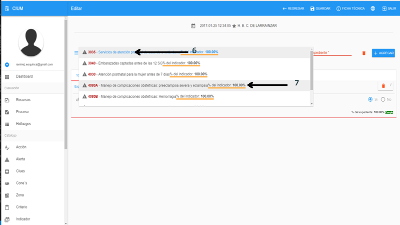

> - 6.- Puede cambiar entre indicadores evaluados recientemente en la lista a lado del menu, aca se muestra el codigo y nombre del indicador
> - 7.- Porcentaje de la evaluacion del indicador

#### Criterios

>**Expedientes**

> - 1.- Escribir el número del expediente a agregar (no se debe repetir en elmismo indicador) si se repite aparece un mensaje como este 
> - 2.- Agregar el expediente al indicador

> - 3.- Si el indicador tiene validacion, nos aparece un cuadro con preguntas. Arriba los botones aplicar y cancelar 
> - 4.- Encabezado que muestra el numero de preguntas
> - 5.- Preguntas, algunas estan con un valor por default y no se pueden cambiar, el tipo puede ser fecha, falso verdadero y números
> - 6.- Si el expediente cumple con la validacion se agregara una pestaña con su número en caso contrario el sistema nos muestra un mensaje para seleccionar otro expediente

> - 7.- Expedientes agregados al indicador, cada expediente cuenta con la lista de criterios a evaluar o evaluados, podemos movernos entre cada pestaña haciendo clic
> - 8.- Los criterios se encuentran agrupados por el nombre del lugar de verificacion
> - 9.- Muestra la estadistica de la evaluacion en el expediente, tambien cuenta con un boton rojo para eliminar el expediente
> - 10.- Respuestas para el criterio, algunas pueden tener validacion y su valor depende de si pase o no

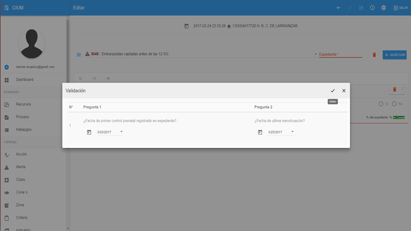

Esta validación funciona igual que la del inidcador

> - 11.- Si en nuestra evaluación encontramos un criterio con un "no" el sistema nos pedira que escribamos un hallazgo y seleccionemos una acción

> - 12.- Regresar a la lista de evaluaciones
> - 13.- Una vez completado todos los expedientes con sus criterios y/o hallazgos se activa el boton para cerrar la evaluacion
> - 14.- Bonton para guardar los expedientes sin cerrar la evaluacion, podemos seguir agregando mas expedientes o modificadon los que ya estan despues de guardar
> - 15.- Eliminar todos los expedientes del indicador

#### Resultado de la evaluación

> - 1.- Regresar al listado
> - 2.- Fecha de creación de la evaluación
> - 3.- Ficha técnica de la unidad médica evaluada
> - 4.- Resultado de los indicadores evaluados
> - 5.- Detalle de los indicadores desglose de criterios y su valor de la evaluación
> - 6.- Ocultar/Mostrar el detalle de criterios para incluir en la impresión o no
> - 7.- Detalle general del indicador para los expedientes
> - 8.- Resultado de la evaluacion por criterios y por expediente
> - 9.- Firma del responsable de la unidad médica
> - 10.- Generar/Imprimir evaluación

#### Enviar por correo el resultado de la evaluación

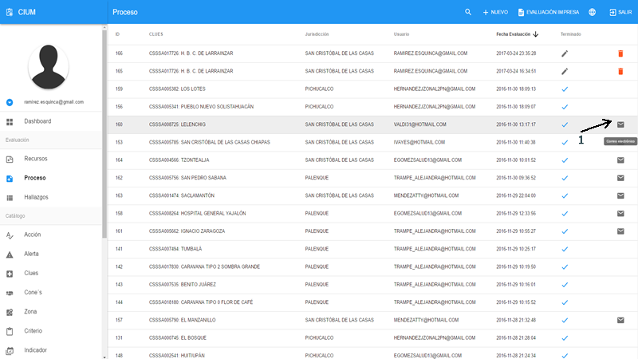

> - 1.- Regresar al listado de las evaluaciones y hacer click en el icono del correo para enviar

## Hallazgo

Hallazgos módulo que muestra de entrada los problemas principales actuales o historico segun el filtro por unidad médica, indicador y criterio.

Podemos acceder al modulo desde la pantalla de inicio "Reporte de hallazgos" o desde el menu lateral "Hallazgo".

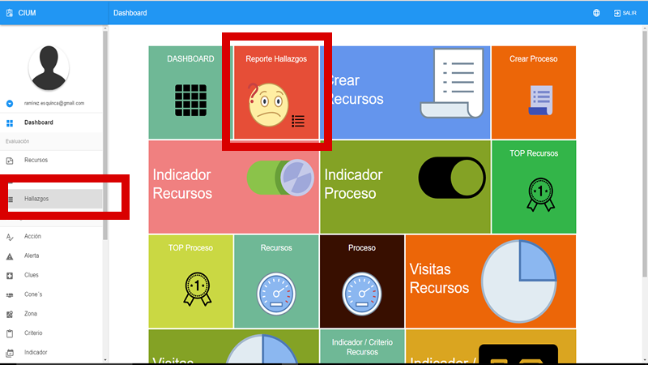

### Listado Criterios

>**Criterios**

Los hallazgos se dividen en 2 pestañas, el primero es la lista de criterios con hallazgos reportados, y la segunda es las unidades médicas en las que se detectaron esos problemas.

> - 1.- Pestaña de criterios con hallazgos
> - 2.- Filtrar/ Buscar un criterio en la lista cargada
> - 3.- Mostrar los criterios de PROCESOS/RECURSO
> - 4.- Ordenar de mayor incidencia a menor y viceversa
> - 5.- Agrupar/Desagrupar los criterios por indicador (por default esta agrupado)
> - 6.- Listado de Indicador/Criterios

> - 7.- Numero de criterios con hallazgos del indicador (Agrupado) al hacer clic muestra los criterios

> - 8.- Nombre del criterio
> - 9.- Cantidad de hallazgos encontrados

Los puntos 8 y 9 se muestra igual si los criterios estan desagrupados

>**Unidades Médicas**

> - 1.- Pestaña de unidades médicas con hallazgos
> - 2.- Datos de la unidad por tabla

### Filtros

Los filtros nos sirven para mostrar la información en un periodo de tiempo o un lugar determinado

>**Elementos generales**

> - 1.- Buscar en la lista de criterios
> - 2.- Abrir las opciones de filtrado en un menu a la derecha 
> - 3.- Lista de indicadores que en el momento actual tiene problemas
> - 4.- Habilitar/Deshabilitar historial, si se habilita el historial muestra los problemas desde la primera evalación hasta la ultima

>**Buscar**

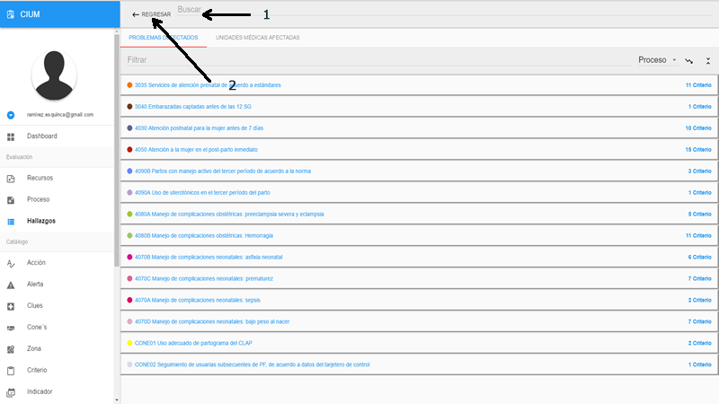

> - 1.- Campo de busqueda
> - 2.- Regresar/Cerrar la busqueda

>**Unidades Médicas**

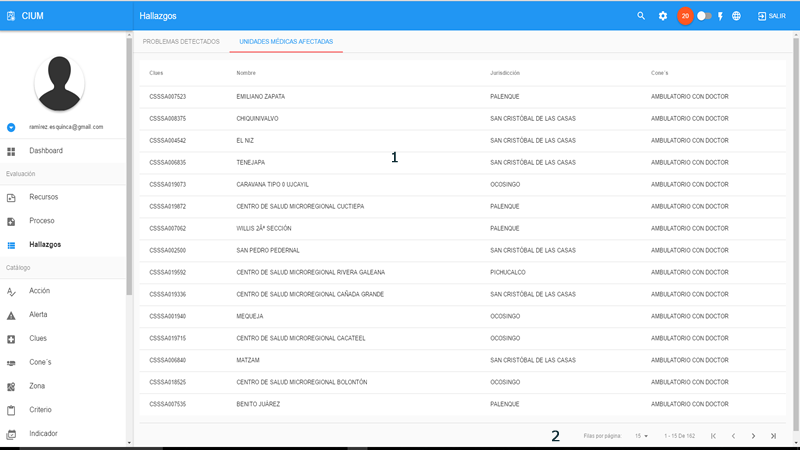

> - 1.- Lista de unidades afectadas
> - 2.- Paginación y limites por página

### Lista de indicadores con detalle

Para ver la lista de indicadores con problemas actual, hacer clic en el menu de arriba en el icono rojo con un numero en medio

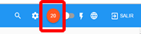

> - 1.- Cantidad de indicadores con problema
> - 2.- Lista de indicadores con problema
> - 3.- Indicador(es) filtrado(s)

### Opciones de filtrado

Las opciones de filtrado toma en cuenta si el historial esta activado, y filtra segun sea el caso. al activar el historial la lista de indicadores con problema desaparece. hal filtrar se afecta a las dos categorias o tabs criterios y unidades medicas

>**Filtro**

Para ver el filtro, hacer clic en el menu de arriba en el icono de la rueda

Aparece un menu de lado derecho con encabezado de color rojo 3 a 4 pestañas segun el filtro

>**Encabezado (HEADER)**

> - 1.- Toolbar con los botones (Filtro)
> - 2.- Aplicar filtro, Esta opción aplica los filtros que el usuario confuguro en cualquiera de las pestañas. Es necesario hacer clic para que se aplique los cambios
> - 3.- Quitar los filtros, Si queremos dejar todo como lo encontramos al entrar al modulo

>**Pestaña 1 (PERIODO)**

> - 1.- Seleccionar el año a filtrar
> - 2.- Quitar el filtro de año seleccionado
> - 3.- Seleccionar el trimestre (Depende del año seleccionado)
> - 4.- Quitar el filtro de trimestre seleccionado
> - 5.- Si no queremos filtrar por trimestre podemos hacer por periodos de tiempo, primero seleccione la fecha de inicio
> - 6.- Seleccione la fecha de fin del peridoa filtrar

Si queremos que los filtros se reflejen hacer clic en aplicar filtro.

>**Pestaña 2 (INDICADOR)**

> - 1.- Opciones "ver todo": filtra todos los indicadores, "Por indicador": Muestra una lista de indicadores para marcar los que aplican al filtro 
> - 2.- Agrupación por categoria "recurso/proceso" de los indicadores
> - 3.- Lista de indicadores disponibles para el filtro

Si queremos que los filtros se reflejen hacer clic en aplicar filtro.

>**Pestaña 3 (PARAMETROS)**

> - 1.- Opciones "ver todo": filtra todos los indicadores, "Filtro": Selecionar las opciones requeridas
> - 2.- Seleccionar uno o mas cones del istado disponible
> - 3.- Limpiar los cones seleccionados del la lista
> - 4.- Seleccionar uno o mas jurisdicciones del istado disponible
> - 5.- Limpiar las jurisdicciones seleccionados del la lista
> - 6.- Opciones "Municipio": Permite sleccionar una lisda de municipios, "Zona": Si estan disponibles las zonas
> - 7.- Seleccionar uno o mas municipios del istado disponible
> - 8.- Limpiar los municipios seleccionados del la lista

Si queremos que los filtros se reflejen hacer clic en aplicar filtro.

### Detalle del problema

Al Hacer click sobre el criterio para el tab PROBLEMAS DETECTADOS o en la unidad médica para el tab UNIDADES MÉDICAS AFECTADAS se puede acceder al detalle del problema de esta manera:

>**Criterios**

> - 1.- Al hacer click en un criterio se habre una ventana con la lista de evaluaciones
> - 2.- Lista de evaluaciones con detalle. Si el historial esta deshabilitado muestra solo la ultima evalación si no muestra todas las evaluaciones

>**Unidades médicas**

> - 1.- Al hacer click en una unidad se habre una lista de los indicadores afectados, si en el filtro se habilito solo un indicador se pasa directo a la lista de evaluaciones

> - 2.- Al hacer click en un inidcador se habre una lista de las evaluaciones

> - 3.- Lista de evaluaciones. Si esta deshabilitado historial solo muestra la evaluacion mas actual si no todas. Al hacer click muestra el detalle del o los inidcadores con sus criterios

Para los dos criterio o unidades médicas llegamos a la vista detalle.

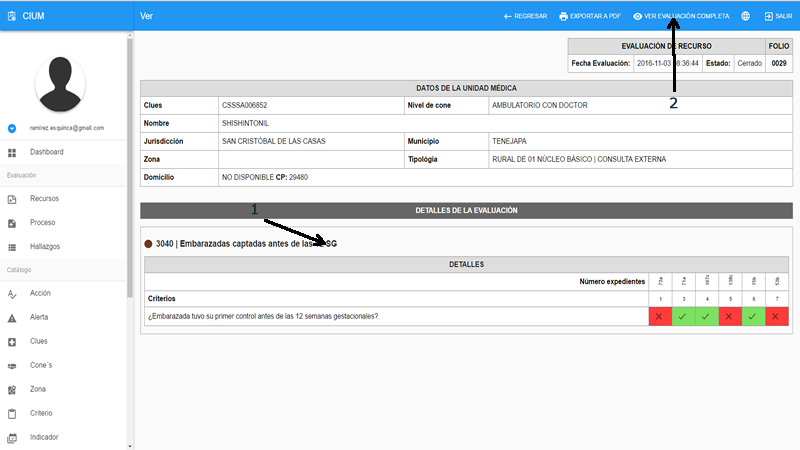

> - 1.- Detalle del o los indicadores unicamente los que tienen detalle
> - 2.- Abrir la evaluación completa y mostrar todos los indicadores que se evaluo

## Inicio

En esta pantalla se encuentras los modulos en forma de iconos tipo windows 8 para acceder de manera rapida a cualquier reporte que ofrece el sistema, unicamente haciendo clic en el de su agrado.

## Dashboard

Este es el primer icono del menu de inicio, aca se encuentra todos los reportes gráficos que se generan con las evaluaciónes capturadas de recursos y procesos. Este es un conjunto de todos los reportes se puede acceder a cada uno para mayor comodidad desde el menu de inicio

>**Elementos generales**

> - 1.- Toolbar con el nombre del gráfico
> - 2.- Abrir el menu de filtro
> - 3.- Ampliar el gráfico
> - 4.- Área de gráficos o datos

>**Filtro**

El filtro es similar para todos los gráficos y reportes por lo que se explica en esta sección y no individualmente por reporte.

>**Encabezado (HEADER)**

> - 1.- Toolbar con los botones (Filtro)
> - 2.- Aplicar filtro, Esta opción aplica los filtros que el usuario confuguro en cualquiera de las pestañas. Es necesario hacer clic para que se aplique los cambios
> - 3.- Quitar los filtros, Si queremos dejar todo como lo encontramos al entrar al modulo

>**Pestaña 1 (PERIODO)**

> - 1.- Seleccionar el año a filtrar
> - 2.- Quitar el filtro de año seleccionado
> - 3.- Seleccionar el trimestre (Depende del año seleccionado)
> - 4.- Quitar el filtro de trimestre seleccionado
> - 5.- Si no queremos filtrar por trimestre podemos hacer por periodos de tiempo, primero seleccione la fecha de inicio
> - 6.- Seleccione la fecha de fin del peridoa filtrar

Si queremos que los filtros se reflejen hacer clic en aplicar filtro.

>**Pestaña 2 (INDICADOR)**

> - 1.- Opciones "ver todo": filtra todos los indicadores, "Por indicador": Muestra una lista de indicadores para marcar los que aplican al filtro 
> - 2.- Agrupación por categoria "recurso/proceso" de los indicadores
> - 3.- Lista de indicadores disponibles para el filtro

Si queremos que los filtros se reflejen hacer clic en aplicar filtro.

>**Pestaña 3 (PARAMETROS)**

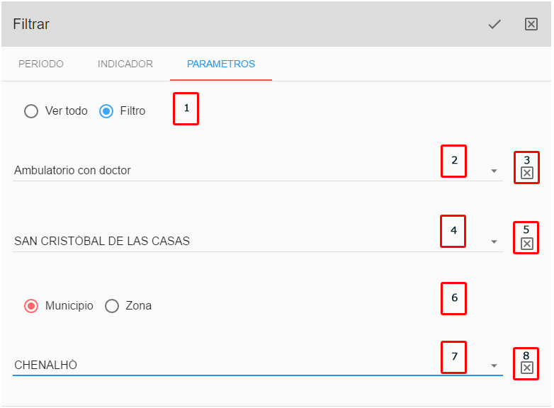

> - 1.- Opciones "ver todo": filtra todos los indicadores, "Filtro": Selecionar las opciones requeridas
> - 2.- Seleccionar uno o mas cones del istado disponible
> - 3.- Limpiar los cones seleccionados del la lista
> - 4.- Seleccionar uno o mas jurisdicciones del istado disponible
> - 5.- Limpiar las jurisdicciones seleccionados del la lista
> - 6.- Opciones "Municipio": Permite sleccionar una lisda de municipios, "Zona": Si estan disponibles las zonas
> - 7.- Seleccionar uno o mas municipios del istado disponible
> - 8.- Limpiar los municipios seleccionados del la lista

Si queremos que los filtros se reflejen hacer clic en aplicar filtro.

### Indicador recurso/proceso

Este grafico muestra la lista de indicadores con el procentaje pintado del color de la configuración de las alertas, su distintivo es que tiene un switch que muetra la informacion del todo o el nada.

Para acceder a este gráfico ir al menú principal y seleccionarlo bien sea de recurso o proceso

>**Indicador**

> - 1.- Switch para activar/desactivar el conteo del todo o el nada
> - 2.- Codigo del indicador
> - 3.- Nombre del indicador
> - 4.- Porcentaje obtenido en la evaluación
> - 5.- Opciones de filtrado

>**Clic en indicador**

Al hacer clic en un indicador aparece un cuadro con el listado de jurisdicciones agrupado por nivel de cone y el porcentaje obtenido para cada uno, como se muestra en la siguiente imagen.

>**Clic en jurisdicción**

Al hacer clic en una jurisdicción aparece un cuadro con el listado de municipios agrupado por nivel de cone y el porcentaje obtenido para cada uno, como se muestra en la siguiente imagen.

>**Clic en municipio**

Al hacer clic en un municipio aparece un cuadro con el listado de clues, se puede hacer clic para ver sus evaluaciones, como se muestra en la siguiente imagen.

>**Clic en clues**

Al hacer clic en una clues aparece un cuadro con el listado de evaluaciones del periodo, se puede hacer clic para ver su ficha y resultados, como se muestra en la siguiente imagen.

>**Parte de la evaluación**

Al hacer clic en una evaluacion aparece un cuadro con parte de la evaluación, se puede hacer clic en el menu "VER EVALUACION COMPLETA" para ver la evaluacion completa, como se muestra en la siguiente imagen.

>**Menú de navegación**

Durante el proceso de detalle del indicador se va creadno unos links en la parte de arriba de bajo del nombre del indicador del header en color rojo. Este menú nos permiten regresar a un estado anterior haciendo click

### Top recurso/proceso

Este grafico muestra la lista de unidades médicas con el top configurable de mejores y peores segun la evaluacion en el periodo

Para acceder a este gráfico ir al menú principal y seleccionarlo bien sea de recurso o proceso

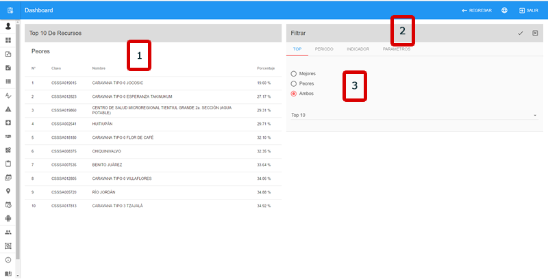

>**Top**

> - 1.- Datos con el top si existe datos puede mostrar 2 ventanas (mejores y peores)
> - 2.- Filtro
> - 3.- Pestaña adicional para seleccionar el tipo de top y el número

### Medicion de hallazgos

Este grafico mide los hallazgos en una gráfica tipo gauge del periodo

Para acceder a este gráfico ir al menú principal y seleccionarlo bien sea de recurso o proceso

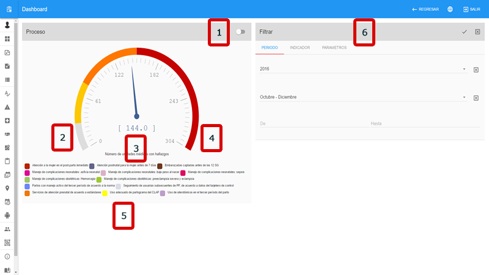

>**Gauge**

> - 1.- Switch para activar/desactivar el modo estricto
> - 2.- Gráfico con datos de medición, la aguja debe estar lo mas cerca posible a 0 para tener un buen desempeño
> - 3.- Numero de unidades con hallazgo
> - 4.- Limite del gráfico determinado por el número de unidades totales (universo)
> - 5.- Indicadores con hallazgo
> - 6.- Filtros

### Reporte de cobertura

Este grafico muestra trimestralmente la cobertura de unidades en el periodo

Para acceder a este gráfico ir al menú principal y seleccionarlo bien sea de recurso o proceso

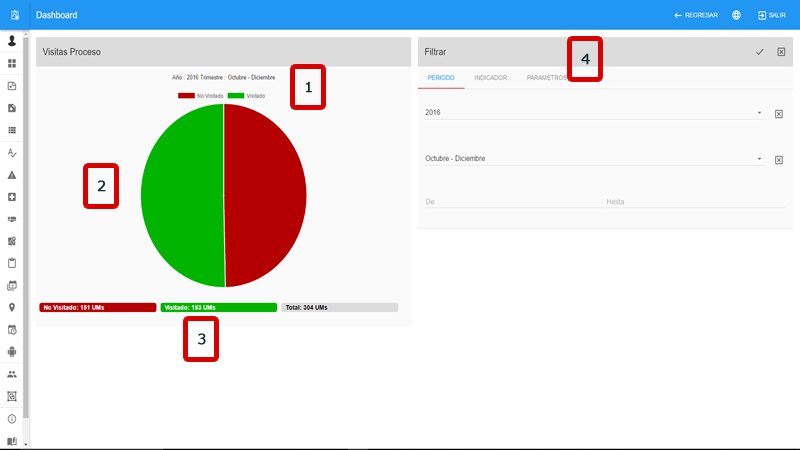

>**Cobertura**

> - 1.- Trimestre que se muestra
> - 2.- Gráfica de pastel en verde lo visitado y en rojo lo que falta por visitar
> - 3.- Mini estadistica del número de unidades a visitar
> - 4.- Filtros

### Reporte indicador/criterio

Este grafico muestra el listado de indicadores y el detalle de criterio por el perido. Por su naturaleza este unico gráfico el reporte tiene un corte al día de su selección, es decir que si el día de hoy se ejecuto a las 8 am y depues alguien  sincronizo evaluaciones estas no apareceran en el reporte hasta el dia de mañana, ya que el reporte se crea a la hora que alguien le dio clic en el día, por lo que para la primera persona que le dio clic la primera vez del día sera lento la carga ya que esta creando la vista para mostrar los criterios

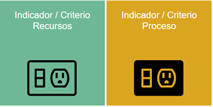

Para acceder a este gráfico ir al menú principal y seleccionarlo bien sea de recurso o proceso

>**Cobertura**

> - 1.- Codigo del indicador
> - 2.- Nombre del indicador
> - 3.- porcentaje obtenido
> - 4.- Filtros

>**Clic en indicador**

Al hacer clic en un indicador aparece un cuadro con el listado de criterios y el porcentaje obtenido para cada uno, como se muestra en la siguiente imagen.

>**Clic en el criterio**

Al hacer clic en un criterio muestra las jurisdicciones y su porcentaje obtenido para cada una, como se muestra en la siguiente imagen.

>**Clic en jurisdicción**

Al hacer clic en una jusrisdiccion muestra las CLUES y su valor obtenido para cada una (100 = si, 0 = no), como se muestra en la siguiente imagen.

//
>**Clic en clues**

Al hacer clic en una clues aparece un cuadro con el listado de evaluaciones del periodo, se puede hacer clic para ver su ficha y resultados, como se muestra en la siguiente imagen.

>**Parte de la evaluación**

Al hacer clic en una evaluacion aparece un cuadro con parte de la evaluación, se puede hacer clic en el menu "VER EVALUACION COMPLETA" para ver la evaluacion completa, como se muestra en la siguiente imagen.

>**Menú de navegación**

Durante el proceso de detalle del indicador se va creadno unos links en la parte de arriba de bajo del nombre del indicador del header en color rojo. Este menú nos permiten regresar a un estado anterior haciendo click

