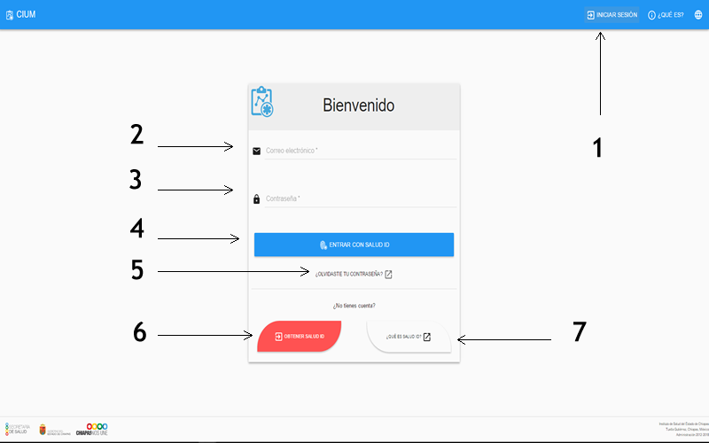
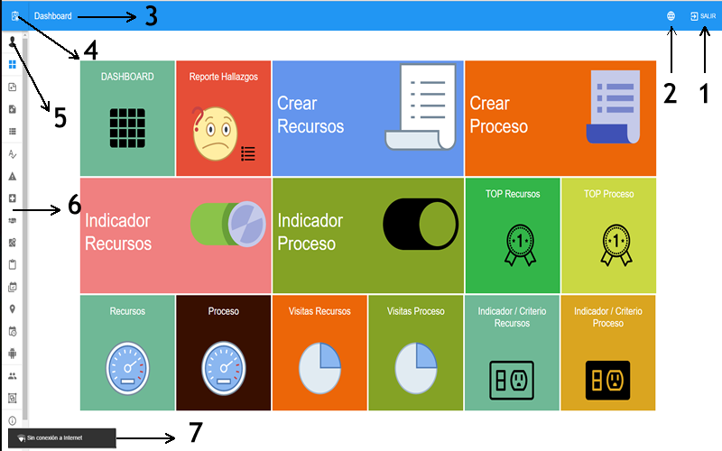
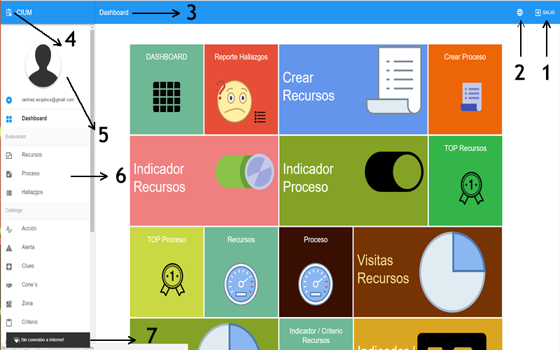

# Introducción

La secretaria de salud (ISECH) a través del Área de Informática de la dirección de planeación, con el apoyo del Proyecto Salud Mesoamérica 2015 (SM2015), pone en marcha el desarrollo del proyecto 
Captura de indicadores de unidades medicas (CIUM), cuyo objetivo es facilitar y fortalecer la detección de la ubicación de los puntos críticos en la medición de proceso y recursos 
en unidades médicas, agilizando la toma de decisiones en todos los niveles provenientes del eTAB, por medio de los cuales se logran alcanzar las metas propuestas por el sector salud.

## Objetivo

El siguiente manual es para explicar el uso de la herramienta web CIUM. 
El CIUM en línea es construido para monitorear en tiempo casi real el progreso de la captura de las evaluaciones a unidades médicas, se dice casi real por que los evaluadores 
trabajan con un dispositivo móvil IOS o Android para la evaluación de las unidades médicas que no cuenten con internet. Posteriormente el dispositivo tendrá que sincronizar toda 
la información que se haya recabado con la base de datos una vez el evaluador alcance la señal de internet

## Inicio de sesión

Como todo sistema de la secretaria de salud esta protegido por usuario y contraseña, asi tambien el CIUM para poder tener acceso es necesario contar con un usuario OAUTH de SALUDID
y que nuestro usuario tenga permisos para acceder al CIUM, en el siguiente esquema se eplica como iniciar sesión.

>**Iniciando sesión**

> - 1.- Si no aparece la pantalla de login dar click en el botón iniciar sesión
> - 2.- Escribir el correo con el que se dio de alta en SALUDID
> - 3.- Escribir la contraseña con  el que se dio de alta en SALUDID
> - 4.- Dar click al botón entrar
> - 5.- Si olvida su contraseña puede recuperarla en la pagina que redirige este botón
> - 6.- Si no tiene cuenta dar click en el botón para darce de alta, despues solicitar que el administrador del CIUM nos de acceso
> - 7.- Muestra información sobre SALUDID

El sistema CIUM esta protegido por permisos. Si al acceder no visualiza algun modulo o alguna accion o aparece un mensaje que dice que no esta permitido es por que no cuenta con los permisos suficientes para acceder
a la información. los permisos los asigna el administrador del sistema CIUM

## Elementos generales

Los elemntos generales son los que siempre estan visibles en cada página del sistema, esta pantalla es el dashboar que nos presenta el sistema al momento de poner nuestras credenciales.

>**General**

> - 1.- Salir: Cierra la sessión y mata el token de acceso
> - 2.- Cambiar idioma: Puede seleccionar el idioma de las etiquetas del sistema. *esto no afecta al contenido
> - 3.- Nombre de la página en la que estamos actualmente
> - 4.- Icono del sistema, tambien funciona como boton para abrir y cerrar el menu con textos
> - 5.- Foto y nombre del perfil del usuario.
> - 6.- Menu disponible
> - 7.- Mensaje que aparece al perder la señal de internet

El dashboard se explica a detalle en el capitulo 4

