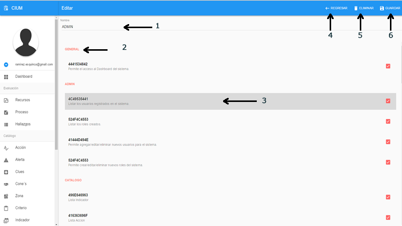
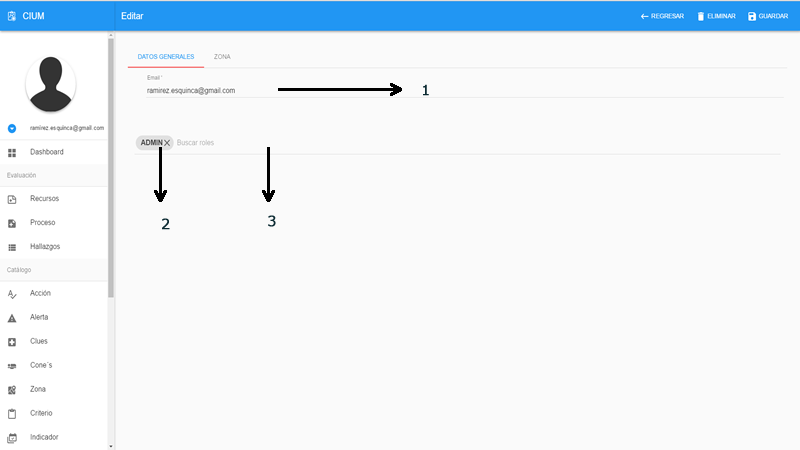
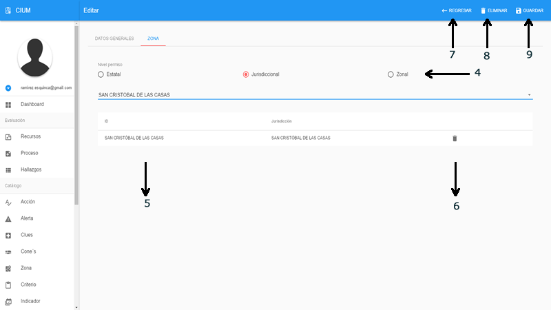

# Sistema

En este apartado esta todo lo relacionado con el usuario, roles y permisos. se pueden configurara permisos por acción lo que hace mas seguro y mas robusto el modelo de permisos.
 
Todos los modulos tiene un listado con las opciones como se describen. 
 

>**Listado**

> - 1.- Buscar
> - 2.- Datos
> - 3.- Eliminar
> - 4.- Agregar un registro nuevo

>**Listado buscar**

> - 5.- Regresar y restablecer las opciones
> - 6.- Campo de busqueda: escribir y dar enter para iniciar la busqueda

## Roles

Roles creacion y administracion de los roles y configuracion de las acceso a modulos por accion. 

>**Crear / Editar**

> - 1.- Nombre del grupo
> - 2.- Módulos disponibles
> - 3.- Acciones en el módulo
> - 4.- Regresar al listado
> - 5.- Guardar 
> - 6.- Eliminar

## Usuario

Usuario administra los usuarios que provienen de SALUD-ID (OAUTH2.0) para que puedan tener acceso al sistema. 

>**Crear / Editar**

> - 1.- Correo del usuario, este es el correo con el que se dio de alta en SALUD-ID
> - 2.- Rol o grupo de usuario. Puede ser uno o más, se puede eliminar desde la x
> - 3.- Buscar agrergar rol 

> - 4.- Apartado zona. Nivel de permiso: Estatal(todas las unidades médicas del estado), Jurisdiccional (todas las unidades médicas de la jurisdiccion), Zonal (todas las unidades médicas de la zona)
> - 5.- Detalle del nivel de permiso ya sea por jurisdiccion o por clues 
> - 6.- Eliminar la fila  
> - 7.- Regresar al listado
> - 8.- Eliminar 
> - 9.- Guardar